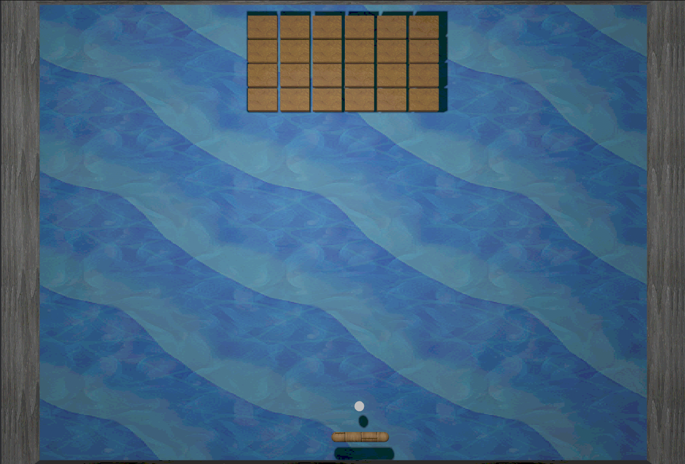
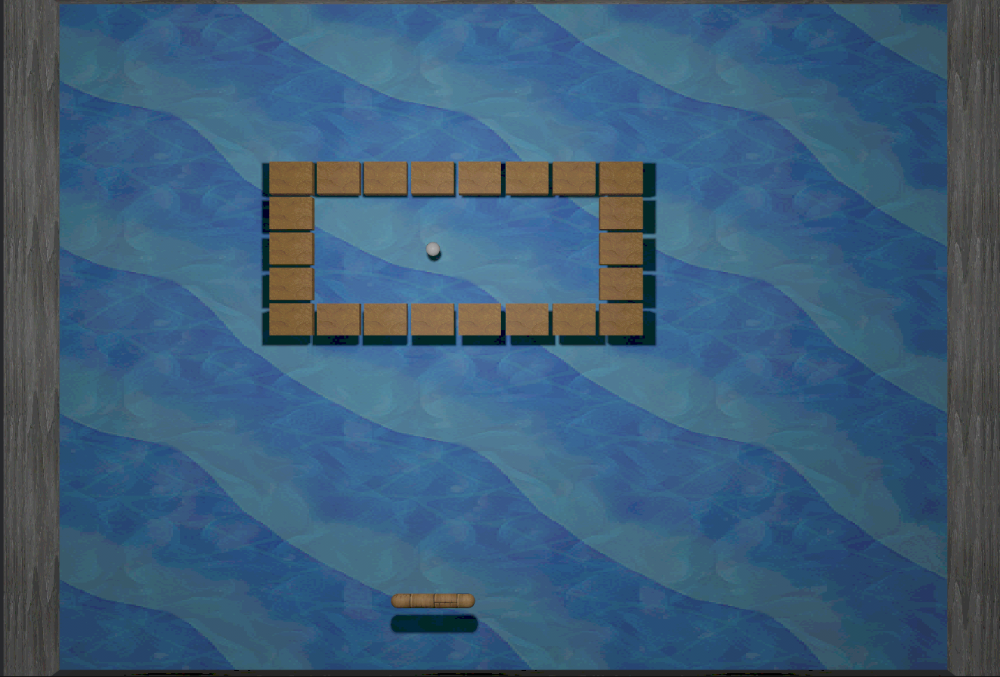

# brkrs — a fun, playable brick-breaker game & learning playground

[](https://crates.io/crates/brkrs) [](https://docs.rs/brkrs) [](LICENSE-agpl-3.0.md) [](https://www.rust-lang.org/) [](https://github.com/cleder/brkrs/actions) [](https://brkrs.readthedocs.io/en/latest/?badge=latest)

**brkrs** is a real, playable Breakout/Arkanoid-style game written in [**Rust** 🦀](https://rust-lang.org/) using the [**Bevy**](https://bevy.org/) engine.
It’s also a **hands-on learning project**, letting you explore:

- **Spec-first development** with GitHub **speckit**
- Incremental feature development through issues & PRs
- AI-assisted and agentic coding experiments

Every feature starts as a spec, flows through an issue or PR, and ends as working Rust code.
You can **play the game, explore the code, and learn modern Rust/Bevy workflows all at the same time**.

> Linus Torvalds said: **“Talk is cheap. Show me the code.”**

brkrs lets you play, tinker, and see the specs come alive in a real game.

---

## The Story Behind brkrs

I always wanted to **rewrite my old [Arkanoid/Breakout-style game, YaAC 🐧](https://github.com/cleder/yaac)**, in a modern game framework.

I began by **manually implementing the core gameplay foundations**: reading documentation, following examples, and building a basic proof-of-concept with the essential mechanics (ball, paddle, bricks).

It quickly became clear that doing everything manually would involve **a steep learning curve and a lot of time**.

brkrs was born as a solution: a way to **learn modern Rust game development**, apply **spec-first workflows**, and experiment with **AI-assisted coding**, all while still having fun playing a real game.

The development process follows the "Kaizen no michi" (改善の道) philosophy of making small, incremental changes to achieve long-term growth and success.

---

## Try it now

You can play a web version on [GitHub Pages](https://cleder.github.io/brkrs/)

**Gameplay snapshot:**

<table>
<tr>
<td width="50%">

<p style="text-align: center;"><em>Current level gameplay</em></p>
</td>
<td width="50%">

<p style="text-align: center;"><em>Next level preview</em></p>
</td>
</tr>
</table>

## Key Features

`brkrs` is a Breakout/Arkanoid style game implemented in Rust with the Bevy engine.
It extends the classic formula with richer physics, paddle rotation, and per-level configuration.

- Classic Breakout-style gameplay: paddle, ball, bricks, and levels
- Levels are human-readable and easy to modify
- Spec-first workflow: every feature begins as a spec and ends as working Rust code
- Small, incremental PRs demonstrate the development workflow and learning path
- Crate-ready and cross-platform (desktop + WebAssembly builds)
- A **fun, approachable way to learn Rust, Bevy, and modern coding practices**

---

## Quickstart (play & learn)

Prerequisites: Rust + Cargo + Git

```bash
git clone https://github.com/cleder/brkrs.git
cd brkrs
cargo run --release
```

Controls: move paddle with mouse, scroll wheel to rotate (if enabled), ESC to pause.

Play, tweak, and learn — modify levels, bricks, or mechanics to see specs turn into features.

---

## Core Systems

1. **Physics (Rapier3D)** – 3D physics constrained to a flat play plane.
2. **Game State** – (planned) menu, playing, paused, game over, transitions.
3. **Level Loader** – RON file parsing, entity spawning, per-level gravity.
4. **Brick System** – Extensible brick behaviors via components & events.
5. **Pause System** – ESC to pause, click to resume, with window mode switching (native).

## Learning Path & Contribution

This project is intended to be **fun and educational**.
Suggested learning steps:

1. **Read a spec** in the repo or wiki
2. **Pick a small issue** to implement
3. **Submit a PR** that fulfills the spec
4. **Experiment** with AI-assisted features or gameplay tweaks

## Documentation

Full documentation is available at **[brkrs.readthedocs.io](https://brkrs.readthedocs.io/)**:

- [Quickstart Guide](https://brkrs.readthedocs.io/en/latest/quickstart.html) — Get running in 10 minutes
- [Developer Guide](https://brkrs.readthedocs.io/en/latest/developer-guide.html) — Set up a development environment
- [API Reference](https://brkrs.readthedocs.io/en/latest/api-reference.html) — Rust API documentation

---

## Why You’ll Enjoy It

- Play a real game while learning coding practices
- Watch specs transform into working features
- Experiment safely with Rust, Bevy, and AI-assisted workflows
- Learn by doing in a **hands-on, playful way**

---

## License

The GNU Affero General Public License is a free, copyleft license for software and other kinds of works, specifically designed to ensure cooperation with the community.
It ensures that any code snippet developed by the open-source community stays available and prevents others from repackaging and selling open-source software without giving back.

This guarantees your freedom to share and change all versions of this program and makes sure it remains free software for all its users.

[](https://www.gnu.org/licenses/agpl-3.0.en.html)
