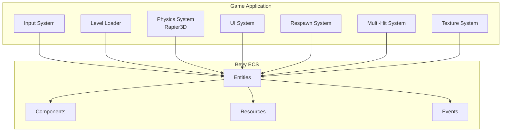
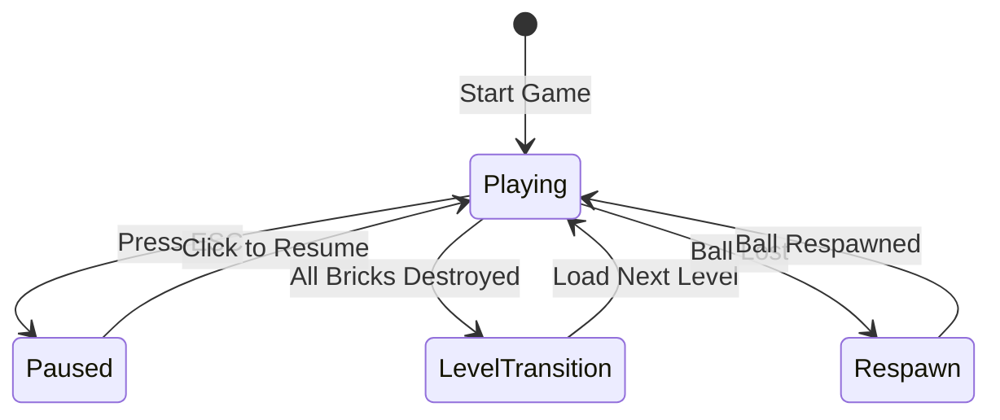
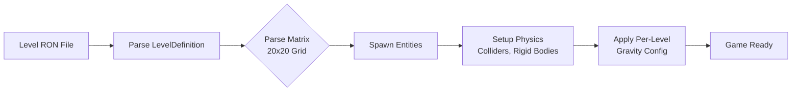

# Brkrs

<div align="center">

[](https://brkrs.readthedocs.io/en/latest/?badge=latest)
[](./LICENSE-MIT)
[](./Cargo.toml)
[](./Cargo.toml)
[](https://bevyengine.org/)
[](https://cleder.github.io/brkrs/)

**A modern Breakout/Arkanoid-style game built with Rust and Bevy, featuring 3D physics, rich gameplay mechanics, and cross-platform support.**

[🎮 Play Online](https://cleder.github.io/brkrs/) • [📖 Documentation](https://brkrs.readthedocs.io/) • [🐛 Report Bug](https://github.com/cleder/brkrs/issues) • [💡 Request Feature](https://github.com/cleder/brkrs/issues)

</div>

---

## Table of Contents

- [About](#about)
- [Features](#features)
- [Quick Start](#quick-start)
- [Screenshots & Demo](#screenshots--demo)
- [Architecture](#architecture)
- [Documentation](#documentation)
- [Controls](#controls)
- [Contributing](#contributing)
- [Technical Details](#technical-details)
- [License](#license)

---

## About

`Brkrs` is a Breakout/Arkanoid style game implemented in Rust with the Bevy engine. It extends the classic formula with richer physics, paddle rotation, and per-level configuration.

The game area is divided into a 20×20 grid. Bricks occupy individual grid cells. Gameplay is rendered in 3D but constrained to a plane at `Y = 2.0`, providing depth and visual appeal while maintaining classic Breakout mechanics.

## Features

### 🎮 Gameplay Features

- **3D Physics Engine** – Powered by Rapier3D with realistic collision detection and response
- **Multi-Hit Bricks** – Bricks that require multiple hits to destroy (indices 10-13)
- **Indestructible Bricks** – Permanent obstacles that don't count towards level completion
- **Pause System** – Full game pause with overlay UI and physics freeze
- **Level Transitions** – Smooth transitions between levels with growth animations
- **Ball Respawn System** – Automatic ball respawn after loss with paddle integration
- **Per-Level Configuration** – Customizable gravity and layout per level

### 🎨 Visual Features

- **Textured Visuals** – Rich texture system with per-level overrides
- **3D Rendering** – Camera positioned above with lighting and shadows
- **Smooth Animations** – Level transition animations and visual feedback
- **Fallback Textures** – Graceful handling of missing texture assets

### 🔧 Technical Features

- **ECS Architecture** – Entity-Component-System design with Bevy
- **Cross-Platform** – Native (Linux/Windows/macOS) and WASM/web support
- **Modular Design** – Independently testable systems and components
- **Performance Optimized** – 60 FPS target on native and WASM platforms
- **File Watcher** – Hot-reload support for development (native only)

## Quick Start

### Prerequisites

- **Rust toolchain** (1.81 or later) — Install via [rustup](https://rustup.rs/)
- **Git** — For cloning the repository
- **Graphics drivers** — OpenGL 3.3+ or Vulkan support

#### Platform-Specific Requirements

<details>
<summary>Linux (Ubuntu/Debian)</summary>

```bash
sudo apt install build-essential pkg-config libasound2-dev libudev-dev
```
</details>

<details>
<summary>Linux (Fedora)</summary>

```bash
sudo dnf install gcc-c++ alsa-lib-devel systemd-devel
```
</details>

<details>
<summary>macOS</summary>

```bash
xcode-select --install
```
</details>

<details>
<summary>Windows</summary>

Install [Visual Studio Build Tools](https://visualstudio.microsoft.com/visual-cpp-build-tools/) with "Desktop development with C++".
</details>

### Installation

1. **Clone the repository**

   ```bash
   git clone https://github.com/cleder/brkrs.git
   cd brkrs
   ```

2. **Build and run**

   ```bash
   cargo run --release
   ```

   > 💡 **Note**: The first build takes several minutes to compile dependencies. Subsequent builds are much faster.

3. **Play!**

   The game starts with Level 1. Use your mouse to control the paddle.

### Play Online (WASM)

No installation required! Play directly in your browser:

👉 **[Play on GitHub Pages](https://cleder.github.io/brkrs/)**

Works on Chrome, Firefox, Safari, and Edge.

## Screenshots & Demo

> 📸 **Note**: Add gameplay screenshots or GIFs here to showcase the game visually.

You can see the game in action by visiting the [web demo](https://cleder.github.io/brkrs/) or running it locally.

## Architecture

Brkrs is built on the [Bevy](https://bevyengine.org/) game engine using an Entity-Component-System (ECS) architecture with Rapier3D for physics simulation.

### System Overview



### Game State Flow



### Level Loading Flow



## Documentation

Comprehensive documentation is available at **[brkrs.readthedocs.io](https://brkrs.readthedocs.io/)**.

### Getting Started

- **[Quickstart Guide](https://brkrs.readthedocs.io/en/latest/quickstart.html)** — Get running in 10 minutes
- **[Troubleshooting](https://brkrs.readthedocs.io/en/latest/troubleshooting.html)** — Common issues and solutions
- **[FAQ](https://brkrs.readthedocs.io/en/latest/faq.html)** — Frequently asked questions

### Developer Resources

- **[Developer Guide](https://brkrs.readthedocs.io/en/latest/developer-guide.html)** — Set up a development environment
- **[Architecture](https://brkrs.readthedocs.io/en/latest/architecture.html)** — System design and ECS patterns
- **[Contributing](https://brkrs.readthedocs.io/en/latest/contributing.html)** — How to contribute to the project
- **[Asset Format](https://brkrs.readthedocs.io/en/latest/asset-format.html)** — Level and texture file formats
- **[Bricks Documentation](https://brkrs.readthedocs.io/en/latest/bricks.html)** — Brick types and behaviors

### API Reference

- **[API Reference](https://brkrs.readthedocs.io/en/latest/api-reference.html)** — Complete Rust API documentation

## Controls

| Action | Input | Notes |
|--------|-------|-------|
| Move paddle | Mouse movement | During gameplay |
| Rotate paddle | Mouse scroll wheel | During gameplay |
| Pause game | `ESC` | Freezes physics, shows overlay |
| Resume game | Left mouse click | When paused |

> **Note**: Controls are keyboard and mouse only. Gamepad and touch support are not currently implemented.

## Contributing

We welcome contributions! Whether you're fixing bugs, adding features, or improving documentation, your help makes brkrs better.

### Quick Contribution Guide

1. **Fork the repository** on GitHub
2. **Create a feature branch**: `git checkout -b feature/amazing-feature`
3. **Make your changes** and test them locally
4. **Run quality checks**:
   ```bash
   cargo fmt --all
   cargo clippy --all-targets --all-features
   cargo test
   ```
5. **Commit your changes**: `git commit -m "feat: add amazing feature"`
6. **Push to your fork**: `git push origin feature/amazing-feature`
7. **Open a Pull Request**

### Contribution Guidelines

- Follow Rust style conventions and run `cargo fmt` before committing
- Add tests for new functionality
- Update documentation for public API changes
- Keep PRs focused on a single feature or fix

📖 **Full contributing guidelines**: [Contributing Guide](https://brkrs.readthedocs.io/en/latest/contributing.html)

## Technical Details

### Core Systems

1. **Physics (Rapier3D)** – 3D physics constrained to a flat play plane
2. **Game State** – Menu, playing, paused, game over, transitions (some planned)
3. **Level Loader** – RON file parsing, entity spawning, per-level gravity
4. **Brick System** – Extensible brick behaviors via components & events
5. **Pause System** – ESC to pause, click to resume, with window mode switching (native)
6. **Respawn System** – Ball respawn after loss with gravity configuration
7. **Multi-Hit System** – Bricks requiring multiple hits with state transitions
8. **Texture System** – Asset loading with per-level overrides and fallbacks

### Plane Constraint

All gameplay bodies lock Y translation (`LockedAxes::TRANSLATION_LOCKED_Y`). The camera sits above looking down, allowing lighting & shadows for a 3D feel while maintaining 2D gameplay.

### Collisions

Rapier handles base reflection via restitution. The paddle imparts directional "english" using recent mouse movement. Bricks may apply custom post-collision effects.

### Pause Behavior

| Aspect | Behavior |
|--------|----------|
| **Physics** | Completely frozen when paused (velocities, positions preserved) |
| **Paddle** | Ignores input when paused |
| **Cursor** | Hidden during gameplay, visible when paused |
| **Window Mode** (Native) | Switches fullscreen→windowed on pause, restores on resume |
| **WASM** | Window mode unchanged (WASM doesn't support fullscreen switching) |

### Level File Format

Levels live in `assets/levels/` and are RON files parsed into `LevelDefinition`:

```rust
LevelDefinition(
  number: 1,
  gravity: (2.0, 0.0, 0.0), // Optional per-level gravity (x,y,z)
  matrix: [ /* 20 x 20 grid of u8 values */ ]
)
```

#### Gravity Override

If `gravity` is present, it sets `GravityConfig.normal` and `RapierConfiguration.gravity` on load. During paddle growth after respawn, gravity is temporarily set to zero and restored afterward.

#### Matrix Cell Values

| Value | Type | Description |
|-------|------|-------------|
| `0` | Empty | No entity |
| `1` | Paddle | First occurrence only |
| `2` | Ball | First occurrence only |
| `3` | Brick | Standard brick |
| `10-13` | Multi-Hit Brick | Requires multiple hits (13→12→11→10→20→destroyed) |
| `20` | Simple Brick | Standard destructible brick |
| `90` | Indestructible Brick | Cannot be destroyed, doesn't count toward completion |

> **Note**: Matrix must be 20×20. Missing paddle or ball results in fallback spawns.

## License

This project is licensed under either of:

- Apache License, Version 2.0 ([LICENSE-APACHE](./LICENSE-Apache-2.0) or http://www.apache.org/licenses/LICENSE-2.0)
- MIT license ([LICENSE-MIT](./LICENSE-MIT) or http://opensource.org/licenses/MIT)

at your option.

---

<div align="center">

**Made with ❤️ using [Rust](https://www.rust-lang.org/) and [Bevy](https://bevyengine.org/)**

[🔗 Repository](https://github.com/cleder/brkrs) • [📚 Documentation](https://brkrs.readthedocs.io/) • [🐛 Issues](https://github.com/cleder/brkrs/issues) • [💬 Discussions](https://github.com/cleder/brkrs/discussions)

</div>
