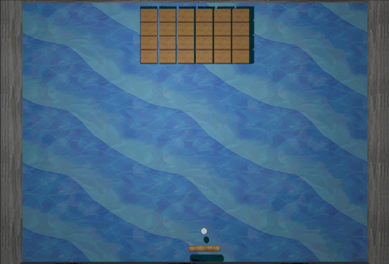

# brkrs — a fun brick-breaker game & learning playground

    

 

<!-- INCLUSION-MARKER-DO-NOT-REMOVE -->

## 🔗 Quick links

The **documentation** is available at **[brkrs.readthedocs.io](https://brkrs.readthedocs.io/)**:

- 🎮 [Play the web version](https://cleder.github.io/brkrs/) — Try it now! 👾
- 📖 [Quickstart Guide](https://brkrs.readthedocs.io/en/latest/quickstart.html) — Get running in 10 minutes 🏁
- 🛠️ [Developer Guide](https://brkrs.readthedocs.io/en/latest/developer-guide.html) — Contribute to the project 🤗
- 📑 [API Reference](https://brkrs.readthedocs.io/en/latest/api-reference.html) — Rust API documentation ⚙️
- 🔮 [GitHub](https://github.com/cleder/brkrs/) — 🧙🏻‍♀️ Here is where the magic happens 🪄

## 🔎 Overview

**brkrs** is a Breakout/Arkanoid-style game written in [**Rust** 🦀](https://rust-lang.org/) using the [**Bevy**](https://bevy.org/) engine.
It extends the classic formula with richer physics, gravity, paddle rotation, and per-level configuration.
Instead of bouncing the ball upward from a paddle that only moves sideways at the bottom of the screen, like a traditional Breakout clone, **brkrs** lets you:

- 🧱 Classic Breakout-style gameplay: paddle, ball, bricks, and levels
- 🖱️ Controls: Move your paddle with the mouse freely anywhere on the screen (not just along the bottom), scroll wheel to rotate.
  Intercept the ball from any direction; above, below, or from the side
- 👀 Play through 70+ levels with varied layouts and challenges.
  Levels are human-readable and easy to modify
- 🕵 Encounter many different brick types with special behaviors (things like gravity effects, magnets, teleporters, explosive bricks, and more), which make the puzzles more complex than simple ball-bouncing.
- 📦 Crate-ready and cross-platform (desktop + WebAssembly builds)

It’s also a **hands-on learning project**, letting you explore:

- 📝 **Spec-first development** with GitHub **[speckit](https://github.com/github/spec-kit)**
- 🤖 AI-assisted and agentic coding experiments
- 🥳 A **fun, approachable way to learn Rust, Bevy, and modern coding practices**

Every feature starts as a spec, flows through an issue (recommended) or directly via PR (if you are bold), and ends as working Rust code.
You can **play the game, explore the code, and learn modern Rust/Bevy workflows all at the same time**.
Play, tweak, and learn — modify levels, bricks, or mechanics to see specs turn into features.

> Linus Torvalds said: **“Talk is cheap.**
> **Show me the code.”**

brkrs lets you play, tinker, and see the specs come alive in a real game.

## 🎓 Learning Path & Contribution

This project is intended to be **fun and educational**.
Suggested learning steps:

1. **Read a spec** in the repo or wiki
2. **Pick a small issue** to implement
3. **Submit a PR** that fulfills the spec
4. **Experiment** with AI-assisted features or gameplay tweaks

Follow "Seika no Ho" (清華の法), "the way of clear planning", a Samurai principle for strategic planning that aligns actions with values.

---

## 🤩 Why You’ll Enjoy It

- Play a real game while learning coding practices
- Watch specs transform into working features
- Experiment safely with Rust, Bevy, and AI-assisted workflows
- Learn by doing in a **hands-on, playful way**

---

## 📜 The Story Behind brkrs

I always wanted to **rewrite my old [Arkanoid/Breakout-style game, YaAC 🐧](https://github.com/cleder/yaac)**, in a modern game framework.

I began by **manually implementing the core gameplay foundations**: reading documentation, following examples, and building a basic proof-of-concept with the essential mechanics (ball, paddle, walls).

It quickly became clear that doing everything manually would involve **a steep learning curve and a lot of time**.

brkrs was born as a way to **learn modern Rust game development**, apply **spec-first workflows**, and experiment with **AI-assisted coding**, all while still having fun playing a real game.

The development process follows the "Kaizen no michi" (改善の道) philosophy of making small, incremental changes to achieve long-term growth and success.

---

## ⚙️ Core Systems

1. **Physics (Rapier3D)** – 3D physics constrained to a flat play plane.
2. **Game State** – (planned) menu, playing, paused, game over, transitions.
3. **Level Loader** – RON file parsing, entity spawning, per-level gravity.
4. **Brick System** – Extensible brick behaviors via components & events.
5. **Pause System** – ESC to pause, click to resume, with window mode switching (native).

---

## 📣 Help Wanted: Your Skills Can Level Up **brkrs**

While the code is coming along nicely, a great game needs more than just logic!
We are actively looking for creative community members to join 🤗 and help turn **brkrs** into a visually 👁️ and aurally 🎧 stunning experience.

This is your chance to get your work into a real, playable, open-source 🐃 game!

- **🎧 Sound & Music:** We need satisfying **sound effects** (the *thwack* of a brick, the *clink* of a power-up) and engaging **background music**.
- **🎨 Art & Textures:** Help us create unique **brick textures**, stylish **paddle designs**, backgrounds, and other necessary **artwork**.
- **📐 Level Design:** Got an evil streak?
  Use the easy-to-modify level configuration files (RON) to create new, challenging, and fun **level designs**!
- **🤔 Testing & Feedback:** Simply playing the game and reporting bugs or suggesting balance tweaks is incredibly valuable!

If you're a designer 🏛, artist 🖌, musician 𝄞, or a gamer 🕹️ with an eye 🧐 for detail, **reach out** or **submit a Pull Request** with your contributions!

<!-- INCLUSION-MARKER-END-DO-NOT-REMOVE -->
---

## ⚖️ License

The GNU Affero General Public License is a free, copyleft license for software and other kinds of works, specifically designed to ensure cooperation with the community.
It ensures that any code snippet developed by the open-source community stays available and prevents others from repackaging and selling open-source software without giving back.

This guarantees your freedom to share and change all versions of this program and makes sure it remains free software for all its users.

