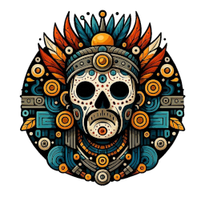
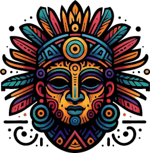
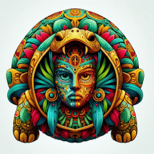
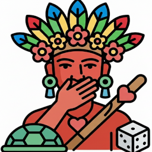
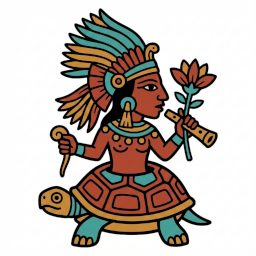

# Macuilxochitl

Macuilxochitl ("Five Flower") is a significant Aztec deity associated with art, music, dance, games, and excessive pleasures like gambling and drinking.
He represents beauty, sensuality, and creativity, often linked to Xochipilli, symbolizing the soul's "blooming" and the sun's flower.
In art he is often emerging from a turtle shell or with flowers, embodying both divine creativity and potential ruin.

Aztec art often depicts Macuilxochitl with red skin, as having a human hand over his mouth, and carrying a sharp stick penetrating a human heart.

Macuilxochitl is the Chief of the Ahuiateteo (gods of excess) and the God of:

- 🎲️ Gambling
- 🃏️ Games
- 🍇️ Feasts
- 🚬️ Tabac smokers
- 💃️ Music and Dance
- 🏑️ Sacred ball game Nahuatl
- 🏰️ Palace Residents
- 🍑 Voluptuousness
- ✍️ Writing
- 🎨️ Painting
- 🍩️ Hemorrhoids
- 💐️ Flowers
- 👻️ Souls

## Images

Disclaimer: These images were generated with AI, they do not represent actual historic artwork and are wildly inaccurate.

    
